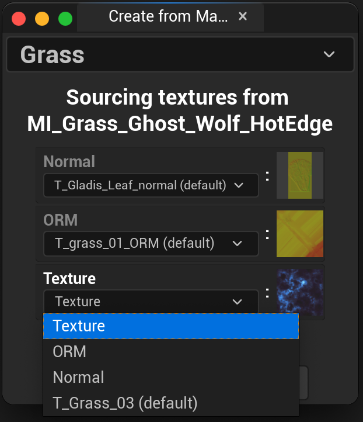

  

<h1 align="center">Unreal Master Material System</h1>

A Master Material System plugin for UE5 
 
This plugin allows us to mark Master Materials in the Content Browser 
and quickly replace existing materials with new Master Material Instances, 
transferring textures over to the new Master Material Instance 
 
created by <a href="https://www.linkedin.com/in/bkortbus/">Brian Kortbus</a>
 
 
 
<a href="https://youtu.be/N3x0DmapOGM?si=rGmjLR0NFCg_zPeJ">Youtube Demo Video</a>

 

## Registering a Master Material

<ul>

In the Content Browser, with a Material selected, use the new `Register Master Material` option
found in the Right Click Menu under the `Master Material` section.

A popup window will let you set the Master Material's display name in the system:

<ul>

</ul>

Once the display name is chosen, your new Master Material will be listed in the `Apply Master Material` 
dropdown menu:

<ul>

</ul>

</ul>  

## Applying a Master Material

<ul>

Applying a Master Material will create a new Material Instance of the desired Master Material next
to the selected material in the Content Browser that we want to replace.

A popup window will let you transfer any textures over to this new Material Instance's texture parameters
from the old material:

<ul>

</ul>

Each Texture Parameter will have a slot in the UI. Use the dropdown menu for each texture parameter slot
to transfer a texture from the material we're replacing. Clicking on a texture icon preview will focus the 
Content Browser to that texture.

 

If `Replace Mesh References` is checked, any Static Meshes or Skeletal Meshes using the old material will
be updated to use the new Material Instance.

 

From the Gif Example above, I updated the new instance's `Normal` and `Texture` parameters with textures from
the wolf's original material:

<ul>

</ul>

 

The new material instance next to the one it replaced:

<ul>

</ul>

</ul>  

## Applying over a Material Instance

<ul>

We can also apply a Master Material to a Material Instance as well! Using the results
of the previous section, here is the window if we apply a Master Material to that Material Instance:

<ul>

</ul>

When transferring textures from a Material Instance it will use the parameter names instead of the texture names.
In this case we are transferring textures from the old material's parameter slot to the new material's parameter slot,
focusing on the use of the texture rather than its file name.

</ul>  

## Create from Master Material As Is

<ul>

Another feature is to just create a new MI in the current Content Browser folder. When no assets are selected
the right click dropdown menu will display as `New From Master Material`:

<ul>

</ul>

This will quickly create a new MI in the current Content Browser folder that we can then rename/edit:

<ul>

</ul>

</ul>  

## Unregistering a Master Material

<ul>

To remove a Master Material from the system, right-click on the material asset and select
the `Unregister` option:

<ul>

</ul>

This will not delete the material or change any existing assets beyond removing it from the list
of available Master Materials.

</ul>  
